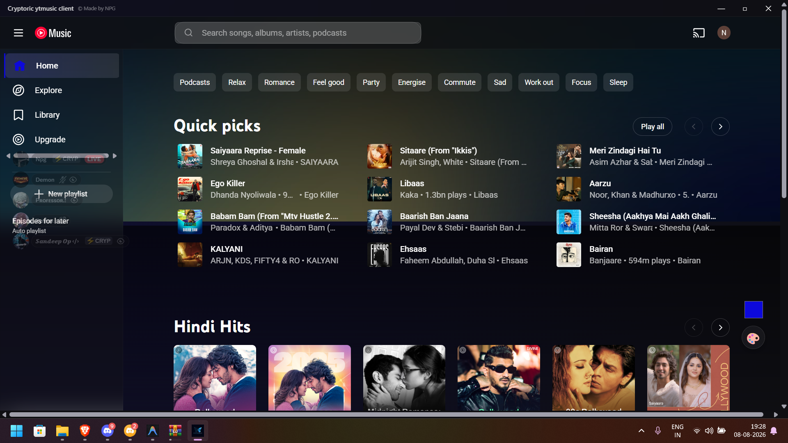
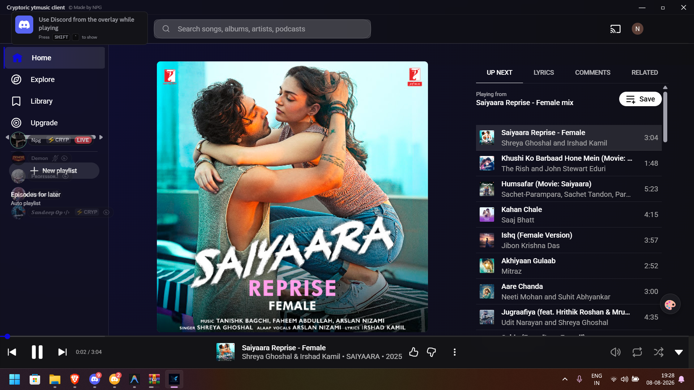

# 🎵 Cryptoric YouTube Music Client

A premium, ultra-lightweight, and lightning-fast YouTube Music desktop client for Windows, engineered from the ground up using **Tauri** and **Rust**.

  
  

## ✨ Features

- **🎨 Custom Glowing UI Themes**: A beautiful, translucent gradient interface. Use the built-in color picker (bottom right corner) to instantly change the entire app's accent color to match your vibe.
- **🚀 Ultra-Lightweight & Blazing Fast**: Built on Tauri v2. Consumes significantly less memory and CPU compared to standard Electron-based clients.
- **🎮 Discord Rich Presence**: Automatically shares what you're currently listening to directly on your Discord profile (Song Name, Artist, Duration, and Play/Pause status).
- **🪟 Sleek Borderless Design**: Custom native titlebar with fluid minimize/maximize/close controls perfectly integrated into the UI.

## 📥 Installation

1. Go to the [Releases](https://github.com/Itz-Npg/Cryptoric-youtube-music-client-for-windows/releases) page.
2. Download the latest installer (`.exe` or `.msi`).
3. Run the installer and follow the prompt to install the app on your system.
4. Launch the app and enjoy!

*(Note: A standalone portable `.exe` is also provided in the releases if you prefer not to install).*

> [!WARNING]  
> **Windows SmartScreen**  
> Since this is a new open-source application and does not possess an expensive corporate code-signing certificate, Windows Defender SmartScreen may display a blue warning screen saying "Windows protected your PC" when you first run the installer or `.exe`.  
>   
> **To safely bypass this:**  
> 1. Click **"More info"** on the blue popup.  
> 2. Click **"Run anyway"**.

## 📜 Credits

- **Made by NPG** (Cryptoric Projects)
